# Verdrahtungsskizze (Schematic)

Dieses Dokument beschreibt die Verdrahtung der Komponenten für den Rotary Phone Agent.

## Wichtige Hinweise
1.  **Stromversorgung (GND):** Alle Komponenten (GND-Pins) müssen mit dem **GND** des ESP32 verbunden sein ("Common Ground").
2.  **Spannung (VCC):**
    *   **3.3V:** BME280, Mikrofone, ESP32 Logik.
    *   **5V (VBUS/Akku):** WS2812B LEDs, LD2410 Radar, DFPlayer (klingt besser an 5V), Verstärker (lauter an 5V).
3.  **Schalter:** Alle Taster (Wählscheibe, Hörer, Buttons) schalten gegen **GND** (da wir `INPUT_PULLUP` nutzen).

## Grafischer Schaltplan

```mermaid
graph TD
    subgraph ESP32_S3 [LilyGO T7-S3 Controller]
        GND[GND]
        V33[3.3V Out]
        V5[5V / VBUS]
        
        %% Audio Bus A (Handset)
        G5[GPIO 5 - LRCLK]
        G6[GPIO 6 - BCLK]
        G7[GPIO 7 - DIN]
        G15[GPIO 15 - DOUT]
        
        %% Audio Bus B (Base)
        G16[GPIO 16 - LRCLK]
        G18[GPIO 18 - BCLK]
        G19[GPIO 19 - DOUT]
        
        %% UART Devices
        G43[GPIO 43 - TX]
        G44[GPIO 44 - RX]
        G39[GPIO 39 - TX]
        G38[GPIO 38 - RX]
        
        %% I2C Sensors
        G8[GPIO 8 - SDA]
        G9[GPIO 9 - SCL]
        
        %% IO & LEDs
        G2[GPIO 2 - LED Data]
        G1[GPIO 1 - Hook]
        G14[GPIO 14 - Dial Pulse]
        G10[GPIO 10 - Btn 1]
        G11[GPIO 11 - Btn 2]
        G12[GPIO 12 - Btn 3]
        G13[GPIO 13 - Btn 4]
        G4[GPIO 4 - Battery ADC]
    end

    subgraph Handset_Audio [Hörer Audio]
        Mic[INMP441 Mikrofon]
        Amp1[MAX98357A Hörer]
        
        G5 -->|LRC| Mic
        G6 -->|BCLK| Mic
        Mic -->|SD/OUT| G7
        
        G5 -->|LRC| Amp1
        G6 -->|BCLK| Amp1
        G15 -->|DIN| Amp1
    end

    subgraph Base_Audio [Sockel Audio]
        Amp2[MAX98357A Lautsprecher]
        DF[DFPlayer Mini]
        
        G16 -->|LRC| Amp2
        G18 -->|BCLK| Amp2
        G19 -->|DIN| Amp2
        
        G43 -->|TX zu RX| DF
        DF -->|TX zu RX| G44
    end

    subgraph Sensors [Sensoren]
        BME[BME280 Klima]
        Radar[LD2410 Radar]
        
        G8 ---|SDA| BME
        G9 ---|SCL| BME
        
        G39 -->|TX zu RX| Radar
        Radar -->|TX zu RX| G38
    end

    subgraph Interface [Telefon Hardware]
        LEDs[WS2812B Strip]
        Hook[Hörer Schalter]
        Dial[Wählscheibe Impuls]
        Btns[Schnellwahl 1-4]
        
        G2 -->|Data In| LEDs
        Hook -->|Schließt nach| GND
        G1 --- Hook
        
        Dial -->|Schließt nach| GND
        G14 --- Dial
        
        Btns -->|Schließen nach| GND
        G10 --- Btns
        G11 --- Btns
        G12 --- Btns
        G13 --- Btns
    end
    
    subgraph Power [Stromversorgung]
        LiPo[LiPo Akku 3.7V]
        LiPo -->|Plus| G4
        LiPo -->|JST Stecker| ESP32_S3
    end
```

## Detaillierte Pin-Liste

### 1. Audio Hörer (I2S Bus A)
*   **INMP441 (Mikrofon):**
    *   SCK -> GPIO 6
    *   WS -> GPIO 5
    *   SD -> GPIO 7
    *   L/R -> GND (für linken Kanal/Mono)
    *   VDD -> 3.3V
    *   GND -> GND
*   **MAX98357A (Hörer-Lautsprecher):**
    *   BCLK -> GPIO 6
    *   LRC -> GPIO 5
    *   DIN -> GPIO 15
    *   VIN -> 5V (oder 3.3V)
    *   GND -> GND

### 2. Audio Sockel (I2S Bus B)
*   **MAX98357A (Großer Lautsprecher):**
    *   BCLK -> GPIO 18
    *   LRC -> GPIO 16
    *   DIN -> GPIO 19
    *   VIN -> 5V
    *   GND -> GND

### 3. Sounds & Klingeln (UART 1)
*   **DFPlayer Mini:**
    *   VCC -> 5V
    *   GND -> GND
    *   RX -> GPIO 43 (Empfohlen: 1k Ohm Widerstand dazwischen)
    *   TX -> GPIO 44
    *   SPK1/SPK2 -> An separaten Lautsprecher (oder via Aux an Amp, aber hier direkt passiv)

### 4. Sensoren
*   **BME280 (I2C):**
    *   SDA -> GPIO 8
    *   SCL -> GPIO 9
    *   VCC -> 3.3V
    *   GND -> GND
*   **LD2410 Radar (UART 2):**
    *   VCC -> 5V (Wichtig! Radar braucht oft saubere 5V)
    *   GND -> GND
    *   RX -> GPIO 39 (ESP TX sendet an Radar RX)
    *   TX -> GPIO 38 (Radar TX sendet an ESP RX)

### 5. Telefon-Mechanik & LEDs
*   **WS2812B LEDs:**
    *   5V -> 5V
    *   GND -> GND
    *   DIN -> GPIO 2
*   **Schalter (Alle):**
    *   Ein Pol an den GPIO (siehe unten), der andere Pol an **GND**.
    *   Hörer (Hook): GPIO 1
    *   Wählscheibe (Impuls): GPIO 14
    *   Taste 1: GPIO 10
    *   Taste 2: GPIO 11
    *   Taste 3: GPIO 12
    *   Taste 4: GPIO 13

### 6. Akku
*   **LiPo:** An den JST-Stecker des T7-S3.
*   **Messung:** Pluspol des Akkus zusätzlich an **GPIO 4** (Der T7-S3 hat oft schon interne Spannungsteiler, aber wir haben GPIO 4 als ADC konfiguriert. Prüfe, ob dein Board das intern verdrahtet hat, sonst musst du eine Brücke legen).
